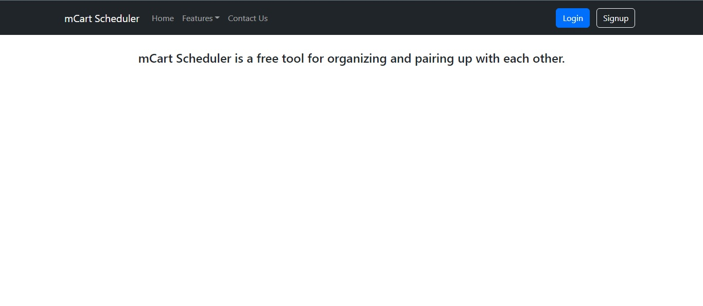

# mCart Scheduler
### An easy-to-use ministry cart scheduler that simplifies the scheduling process for trolly-work.

## Key qualities of the scheduler:
- <i>simplicity</i>
- <i>coherence</i>
- <i>efficiency</i>
- <i>productivity</i>

### This project aims to be suitable for but not limited to non-technical ones, young, elderly, infirm, etc.

# Development

## Testing
- Ensure that you have run `npm install`.
- Run: `npm test` in this project's root directory.
- Do a Ctrl-C when done.
- Please ensure that if you are going to test on another computer/mobile phone, change the config.js to be your IP for the backend URL.

 

# Progress

